<!-- KEYWORDS: claude code skill, brain dump to build, 12-stage product orchestrator, idea to product, ai product manager, ai business analyst, ai architect, dynamic intake, pyramid questioning, spec-driven development, github spec-kit, brd, mvp, business plan, technical analyst, constitution, claude code, octalum, octalume, customer brain dump, non-technical operator, ai-led delivery, stage gates, cost ledger, handoff -->

<div align="center">

# octalum-bdtb

**A 12-stage Claude Code Skill that turns a non-technical customer brain-dump into a delivered product.**

[](https://github.com/Harery/octalum-bdtb/actions/workflows/ci.yml)
[](LICENSE)
[](https://docs.anthropic.com/claude-code)
[](https://www.python.org/downloads/)
[](#)
[](https://github.com/Harery/octalum-bdtb)

</div>

> Paste a customer's raw idea, voice-memo transcript, or rambling Slack message. The skill drives a 12-stage pipeline — intake, BRD, MVP, business plan, tech stack, spec-kit constitution, logic, diagrams, build, monitoring, maintenance — with the AI doing 90–95% of the work and stage-gates at every hand-off.

<p align="right"><sub><code>DRAWING NO. 04.00  ·  REV. 2026.05  ·  SHEET 04 OF 05</code></sub></p>

[Problem](#the-problem) · [Install](#install) · [Quickstart](#quickstart) · [Pipeline](#the-12-stage-pipeline) · [What gets produced](#what-gets-produced) · [How it works](#how-it-works) · [Offline CLI](#offline-cli-fallback) · [Comparison](#comparison) · [FAQ](#faq) · [Roadmap](#roadmap)

## The problem

A real customer brain-dump is messy, jargon-free, contradictory, and missing 80% of the details an engineer would need before writing a single line of code. Most "idea-to-code" tools either skip straight to generation (and ship the wrong product) or hand a non-technical operator a 30-question form (which they abandon). `octalum-bdtb` runs a **dynamic, pyramid-narrowing pipeline** where Claude reads the dump, asks only the questions that fill real gaps, and walks the project from idea to delivered codebase with explicit approval gates between stages.

## Install

```bash
git clone https://github.com/Harery/octalum-bdtb ~/octalum-bdtb
cp -r ~/octalum-bdtb/skill ~/.claude/skills/brain-dump-to-build   # installs the skill into Claude Code
```

Then in any Claude Code conversation, paste a customer's raw idea or say *"I have a brain dump, turn this into a product"* — the skill triggers automatically.

## Quickstart

```bash
# 1. Install the skill (one-time)
cp -r skill ~/.claude/skills/brain-dump-to-build

# 2. Start a new Claude Code session in an empty project directory
mkdir my-customer-project && cd my-customer-project && claude

# 3. Paste the customer's raw idea — the skill takes over from there.
```

Claude will open with: *"Tell me about your idea — don't worry about structure, don't worry about details. Just write it the way you'd explain it to a friend."* — then walk you through 12 stage-gated steps.

## The 12-stage pipeline

```mermaid
flowchart LR
  S1[S1 Intake] --> S2[S2 BRD]
  S2 --> S3[S3 MVP]
  S3 --> S4[S4 Business Analysis]
  S4 --> S5[S5 Business Plan]
  S5 --> CK[Compaction checkpoint]
  CK --> S6[S6 Tech Stack]
  S6 --> S7[S7 Constitution + CLAUDE.md]
  S7 --> S8[S8 Logic]
  S8 --> S9[S9 Diagrams]
  S9 --> S10[S10 Build]
  S10 --> S11[S11 Monitoring]
  S11 --> S12[S12 Maintenance]
```



| Stage | Layer | Output |
|:--|:--|:--|
| 1 — Intake | Macro | `docs/product-spec.md` |
| 2 — BRD | Macro→Meso | `docs/BRD.md` |
| 3 — MVP | Meso | `docs/MVP.md` |
| 4 — Business analysis | Meso→Micro | `docs/business-analyst-plan.md` |
| 5 — Business plan | Micro | `docs/business-plan.md` |
| 6 — Tech stack | Nano | `docs/technical-analyst-plan.md` + `docs/tech-stack.md` |
| 7 — Constitution | Nano | `.specify/memory/constitution.md` + `CLAUDE.md` + `MEMORY.md` + `HANDOFF.md` |
| 8 — Logic | Nano→Atomic | `docs/logic.md` |
| 9 — Diagrams | Atomic | `docs/diagrams.md` |
| 10 — Build | Build | codebase |
| 11 — Monitoring | Build | observability config |
| 12 — Maintenance | Build | MEMORY.md upgrade cycle |

Stage 7 is **spec-kit-compatible by design** — the generated `constitution.md` is principles-only, declarative, and drops straight into a [github/spec-kit](https://github.com/github/spec-kit) workflow. See [ALIGNMENT.md](ALIGNMENT.md).

## What gets produced

```text
project-root/
├── CLAUDE.md                          # ≤ 100 lines, uses @ imports
├── MEMORY.md                          # .claude/memory/, ≤ 200 lines
├── HANDOFF.md                         # snapshot at every pause / session end
├── cost-ledger.md                     # born S6, updated S10 + S12
├── .specify/memory/constitution.md    # spec-kit format
├── docs/
│   ├── product-spec.md
│   ├── BRD.md
│   ├── MVP.md
│   ├── business-analyst-plan.md
│   ├── business-plan.md
│   ├── technical-analyst-plan.md
│   ├── tech-stack.md
│   ├── logic.md
│   └── diagrams.md
└── (codebase generated at Stage 10)
```

## How it works

**Pyramid questioning.** Questions narrow as the pipeline descends — `Macro → Meso → Micro → Nano → Atomic`. Stage 1 generates **exactly 9 dynamic questions** based on what the dump actually leaves unclear (not a template). Each question offers 4 choices + a recommended pick + a custom open answer. Subsequent stages get progressively smaller question budgets and Stage 9+ asks zero.

**Operator / AI division.** The skill assumes a non-technical operator translating a real customer's intent. Claude owns 90–95% of the work — discovery, business logic, architecture, stack picks, code generation, deployment, monitoring. The operator's only job is: pass the dump, translate when something is unclear, and approve at each stage gate (yes / revise / skip).

**Token conservation.** Only one stage sub-skill loads at a time. `CLAUDE.md` is capped at 100 lines (uses `@imports`). `MEMORY.md` at 200. A mandatory compaction checkpoint runs after Stage 5.

**Silent firewall.** 34 quality checks run silently before every delivery — covering questionnaire integrity, jargon, hallucinated versions, spec-kit conformance, file-output completeness, Ubuntu compatibility, SEO. Failures fix silently. The customer never sees the checks.

Full reference: [`skill/SKILL.md`](skill/SKILL.md) · [`skill/references/architecture.md`](skill/references/architecture.md) · [`skill/references/operating-constraints.md`](skill/references/operating-constraints.md)

## Offline CLI fallback

A zero-dependency Python CLI ships in this repo for **non-interactive use** — useful when you want a templated `specs/<feature>/` tree without firing up Claude Code, or for CI smoke-checks of the skill's expected outputs. It only covers the spec-kit subset of Stage 7 (and a Stage 1 product-spec stub); it does **not** drive the full 12-stage pipeline.

```bash
pip install git+https://github.com/Harery/octalum-bdtb
echo "# Cat-sitter SaaS" > dump.md
octalum-bdtb dump.md --output-dir ./plan
```

Outputs `memory/constitution.md` + `specs/<feature>/{spec,plan,research,data-model,quickstart,tasks}.md` + `contracts/`. Add `--target octalum-classic` for the legacy 5-file shape (STRUCTURE / STACK / PHASES / RISKS / BUILD_NOW.sh). Examples: [`examples/saas/output-spec-kit/`](examples/saas/output-spec-kit/).

For the full experience — dynamic intake, business plan, build, monitoring — use the skill in Claude Code.

## Comparison

|  | octalum-bdtb skill | gpt-engineer | Aider | Cookiecutter | bare spec-kit |
|:--|:--|:--|:--|:--|:--|
| Input form | Free-form customer brain-dump | Polished prompt | Existing repo | Pre-filled variables | Hand-authored `spec.md` |
| Pipeline | 12 stage-gated stages | One pass | Conversational diffs | Variable substitution | One pass |
| Dynamic questioning | Yes (pyramid, 9 per stage shrinking) | No | No | No | No |
| Output scope | product-spec → BRD → MVP → biz plan → constitution → built code → monitoring | Full app source | Diffs to a repo | Templated skeleton | Whatever you typed |
| Spec-kit compatible | Yes (Stage 7) | No | No | No | Yes (it *is* spec-kit) |
| Approval gates | After every stage | None | Per turn | None | None |
| Non-technical operator | Yes | No | No | No | No |

## FAQ

### How is this different from gpt-engineer or Aider?

Those tools write code. This skill writes *the strategy first* — product spec, business plan, tech stack — runs approval gates, then writes the code at Stage 10. Different phase of the project, different deliverable.

### Do I need an API key?

The skill runs inside Claude Code, which already handles auth. The offline CLI is 100% deterministic, no LLM, no key, no network.

### Does it work with github/spec-kit?

Yes — Stage 7 generates a spec-kit-conformant `.specify/memory/constitution.md` plus a `CLAUDE.md` that hands off cleanly to `/speckit.plan`, `/speckit.tasks`, and `/speckit.implement`. See [ALIGNMENT.md](ALIGNMENT.md).

### Is this for technical or non-technical operators?

Non-technical. The operator's only job is to pass the customer's dump, translate intent when something is unclear, and click yes/revise/skip at each stage gate. The AI owns every technical decision.

### What's the OCTALUM connection?

`octalum-bdtb` is Phase-0 of the [OCTALUM family](https://github.com/Harery?tab=repositories&q=OCTALUM) — the part that turns a vague idea into a buildable spec. After Stage 9 (diagrams), the build hands off cleanly to [OCTALUME](https://github.com/Harery/OCTALUME)'s 8-phase enterprise SDLC for regulated industries.

### What about cost?

Stage 6 spawns a `cost-ledger.md` that tracks free/OSS-tier choices first, with paid tools surfaced for explicit operator approval. Updated at S10 and S12.

### When will it hit PyPI?

PyPI trusted publisher is registered pending the user; until then install via `git+https://github.com/Harery/octalum-bdtb` or just install the skill directly.

## Documentation

- [`skill/SKILL.md`](skill/SKILL.md) — the orchestrator manifest (verbatim from the installed skill)
- [`skill/stages/`](skill/stages/) — per-stage sub-skill instructions (s01–s12)
- [`skill/references/`](skill/references/) — operating constraints, voice guide, architecture, enhancements
- [`ALIGNMENT.md`](ALIGNMENT.md) — how Stage 7 composes with github/spec-kit
- [`examples/`](examples/) — three worked brain-dump examples with rendered output trees
- [`PUBLISHING.md`](PUBLISHING.md) — PyPI trusted publisher setup
- [`CHANGELOG.md`](CHANGELOG.md) · [`SECURITY.md`](SECURITY.md) · [`CITATION.cff`](CITATION.cff)

## Roadmap

- **2026-Q3** — PyPI trusted publisher live; `pipx install octalum-bdtb` works
- **2026-Q3** — `--mode interactive` in the CLI gates a Stage-1 9-question intake offline
- **2026-Q4** — Live cost-ledger integration with the OCTALUM-PULSE fleet
- **2026-Q4** — Reference build sample in `examples/full-pipeline/` (every stage's output for one project)
- **2027-Q1** — `--target aider` and `--target cursor` for cross-tool plan handoff
- **2027-Q2** — Skill v2 with multi-language operator voice (E7 enhancement)

## Contributing · License · Security

- See [`CONTRIBUTING.md`](CONTRIBUTING.md) for the PR workflow.
- Code MIT. Skill content MIT. See [`LICENSE`](LICENSE).
- Responsible disclosure: [`SECURITY.md`](SECURITY.md) → `mohamed@harery.com`.
<!-- ============================================================== -->
<!-- UNIFIED OCTALUM FAMILY FOOTER — keep verbatim across every repo -->
<!-- ============================================================== -->

---

<div align="center">

### Drawn by the same hand

A working portfolio of digital infrastructure, designed and maintained by [**Mohamed Harery**](https://harery.com) — Architect of Digital Systems.

| Sheet | Repo | What it is |
|:--:|:--|:--|
| 00 | [**harery.com**](https://github.com/Harery/Mo) | The studio — portfolio, ledger, contact |
| 01 | [**OCTALUME**](https://github.com/Harery/OCTALUME) | 8-phase enterprise SDLC framework |
| 02 | [**OCTALUM-PYLAB**](https://github.com/Harery/OCTALUM-PYLAB) | Python DSA & coding-interview prep |
| 03 | [**OCTALUM-PULSE**](https://github.com/Harery/OCTALUM-PULSE) | Cross-distro Linux maintenance CLI |
| 04 | [**octalum-bdtb**](https://github.com/Harery/octalum-bdtb) | Brain-dump → spec-kit-shaped plan |

<sub>
  <a href="https://harery.com">harery.com</a> ·
  <a href="https://github.com/Harery">github.com/Harery</a> ·
  <a href="https://www.linkedin.com/in/harery/">LinkedIn</a>
</sub>

<sub>BLUEPRINT · drawn 2026 · MIT-licensed code · all drawings reserved</sub>

</div>
